The game contains 19 sprites. Each sprite has four versions for different sub-byte X positions; in mode 5, each byte of screen memory contains four pixels and having these pre-defined versions saves doing bit shifting when plotting data to the screen. It also allows animation "for free" by automatically changing the sprite's appearance based on its X co-ordinate.

| physical | logical | frames | animation | notes |
| --------:| -------:| ------ | --------- | ----- |
| 0 &4000  |     1-8 |     |  | Final Guardian/Demon Lord |
| 1 &40C0  |       9 |  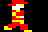   |  | Human, right |
| 2 &4180  |      10 |  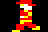   |  | Human, left |
| 3 &4240  |      11 |  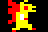   |  | Gargoyle, right |
| 4 &4300  |      12 |    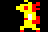 |  | Gargoyle, left |
| 5 &43C0  |      13 |     |  | Harpy, right |
| 6 &4480  |      14 |     |  | Harpy, left |
| 7 &4540  |      15 |    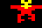 |  | Winged creature |
| 8 &4600  |      16 |   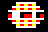  | 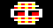 | Robot sentinel |
| 9 &46C0  |      17 |     |  | Fleece/MacGuffin/unused/Prism |
| 10 &4780 |      18 |     |  | Health pickup |
| 11 &4840 |      19 |     |  | Veil of Ambiguity |
| 12 &4900 |      20 |     |  | Wall enemy, left |
| 13 &49C0 |      21 |     |  | Wall enemy, right |
| 14 &4A80 |      22 |     |  | Eye enemy |
| 15 &4B40 |      23 |     |  | Statue |
| 16 &4C00 |      24 |     |  | Sun |
| 17 &4CC0 |      25 |     |  | Moon |
| 18 &4D80 |      26 |     |  | Veil of More Ambiguity |

| physical | frames |
| --------:| ------ |
|  0       |     |
|  1       |     |
|  2       |    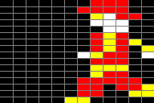 |
|  3       |     |
|  4       |     |
|  5       |   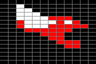  |
|  6       |     |
|  7       |     |
|  8       |    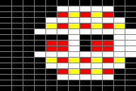 |
|  9       |     |
| 10       |     |
| 11       |     |
| 12       |     |
| 13       | 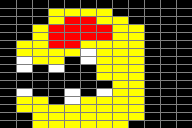    |
| 14       |     |
| 15       |     |
| 16       |   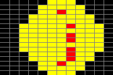  |
| 17       |     |
| 18       |     |

| physical | behaviour |
| --------:| --------- |
| 0 | Guards the exit only if the player has the fleece and is trying to escape for a 100% win. Appears to be the initials of the game developer. |
| 5/6 | Moves horizontally back and forth across the whole screen, but tracks the player's vertical position. |
| 7 | Slowly homes in on the player. Damages the player in human form, but the gargoyle appears to be (mostly) immune. |
| 8 | Moves in a fixed route around the screen. |
| 9 | TODO |
| 10 | Restores the player's health if touched. Can only be used once, disappears permanently once touched. |
| 11 | Guards the exit and secret room once the player has collected all four prisms. |
| 12/13 | Hurts the player if touched but doesn't do anything else. |
| 14 | Normally moves around the screen like the robot sentinel (physical sprite 8); homes in on the player in the screen room. |
| 15 | Hurts the player if touched when human but doesn't do anything else. |
| 16 | Used to show the progress of time while the player is a human. |
| 17 | Used to show the progress of time while the player is a gargoyle. |
| 18 | Replaces an enemy in one of the rooms after the player has collected all four prisms. |
